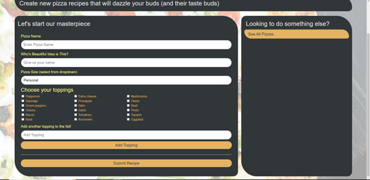

# Pizza Hunt 

## Description
 Pizza Hunt, a social media recipe app, where users can post their creative spins on a pizza, add comments to recipes, and create threads within comments. This application utilizes node.js, mongoose, MongoDB, heroku, MongoDB Atlas. 
 
 With Pizza Hunt front-end already existing, the backend was created for this app.

## Table of Contents 
  * [Installation](#installation)
  * [Usage](#usage)
  * [Important-Links](#Important-Links)
  * [Questions](#questions)

  ## Installation
  * Ensure you are in your root folder,then open terminal and clone code from github. Then run these in the command terminal:

  * Next, run "npm i -y" to install packages 
  * Follow other documentation on how to install MongoDB, set up environment variables, Setup MongoDB Atlas, and deploy to Heroku and MongoDB Atlas

   ## Usage 
  Used to create their own pizza recipe and othe users can comment and reply with suggestions, thoughts and opinions. 
  * Firstly, open the terminal if deploying locally
  * "npm start" to start the server and then in your browser type "localhost:3001" to access the app.
  * To deploy from Heroku, once MongoDB and Heroku are fully setup, type in terminal "heroku open" or copy the application link to the browser to access the social media app. 

   

   
 
   
 
   
  
    

 ## Important Links 
* GitHub Link: https://github.com/MichaelZimm20/team-profile-generator

* Application Demonstration Link: https://www.loom.com/share/79500454cfcb4875a23b4673567f1277

## Questions 
  If you have any questions or concerns, contact:
  * GitHub: [MichaelZimm20](https://github.com/MichaelZimm20)
  * Email: [m.zimm20@gmail.com](mailto:m.zimm20@gmail.com)
